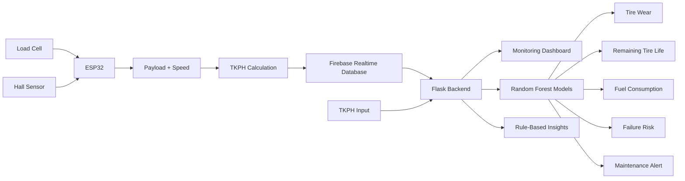

# 🚛 TKPH Tire Monitoring & Predictive Analytics System

<p align="center">
  
  
  
  
</p>

<p align="center">
  
  
  
</p>

> **A predictive tire-health and truck-monitoring system that combines embedded sensing, Firebase real-time telemetry, machine learning, and a browser-based analytics dashboard.**

---

## 📌 Overview

**TKPH Tire Monitoring & Predictive Analytics System** is a predictive-maintenance prototype designed to monitor truck operating conditions and estimate tire-health indicators using **TKPH (Ton-Kilometers Per Hour)**.

The system combines:

- **ESP32-based sensing** for payload and wheel-rotation measurements
- **Firebase Realtime Database** for storing truck readings
- **Machine learning models** for tire-wear, remaining-life, fuel-consumption, and failure-risk predictions
- **Flask web application** for monitoring and prediction workflows
- **Rule-based insights** that translate predictions into practical maintenance recommendations

### 🔄 End-to-End Flow

```text
Physical Sensors
      ↓
     ESP32
      ↓
Speed + Payload
      ↓
     TKPH
      ↓
Firebase Realtime Database
      ↓
Flask Backend
      ↓
Web Dashboard
      ↓
Machine Learning Models
      ↓
Tire Health + Failure Risk + Maintenance Insights
```

---

## 🎯 Problem Statement

Heavy-duty vehicles operate under changing combinations of **speed and payload**. High operating load can increase tire stress, heat generation, wear, and the likelihood of maintenance issues.

This project explores a data-driven approach where TKPH is used as a key operating indicator to:

- monitor current truck conditions
- estimate tire wear
- estimate remaining tire life
- estimate fuel consumption
- classify tire-failure risk
- identify maintenance conditions
- provide actionable operating recommendations

---

## ✨ Key Features

### 📡 Real-Time Truck Monitoring

The embedded system collects:

- Vehicle payload
- Wheel rotations
- Calculated speed
- TKPH

The readings are transmitted to **Firebase Realtime Database** and consumed by the Flask dashboard.

### 🤖 Machine Learning Predictions

Two Random Forest models are used.

**Regression model**
- Tire Wear (%)
- Remaining Tire Life (Hours)
- Fuel Consumption (L/h)

**Classification model**
- Tire Failure Risk
- Maintenance Alert

### 📊 Interactive Web Dashboard

The Flask application provides:

- Current speed
- Current payload
- Current TKPH
- Real-time trend visualization
- Truck monitoring
- Prediction workflow
- Prediction history
- CSV-based prediction records

### 🔮 TKPH-Based Prediction

Users can provide a vehicle number and TKPH value. The system generates:

- Tire-wear prediction
- Remaining tire life
- Fuel-consumption estimate
- Failure-risk classification
- Maintenance alert
- Rule-based recommendations

### 🧠 Hybrid ML + Rule-Based Insights

The application supplements machine-learning predictions with operating-condition rules, allowing the system to turn model outputs into practical maintenance-oriented recommendations.

### 🔌 Hardware Integration

The ESP32/Arduino component integrates:

- HX711 load-cell interface
- Hall-effect sensor
- Wi-Fi
- HTTP communication
- ArduinoJson
- Firebase Realtime Database

---

## 🏗️ System Architecture



---

## 🧮 TKPH Calculation

The project uses:

```text
TKPH = Payload (tons) × Speed (km/h)
```

The ESP32 calculates speed from wheel revolutions and wheel circumference, while the load-cell interface provides the payload measurement.

The resulting TKPH value is sent to Firebase and can also be supplied directly to the prediction interface.

---

## 🧠 Machine Learning Pipeline

### 1. Synthetic Data Generation

The project includes a data-generation workflow for creating synthetic TKPH observations.

The training dataset contains **1,000 samples**, with TKPH values generated between **50 and 600**.

Derived targets include:

- Tire Wear (%)
- Remaining Tire Life (Hours)
- Fuel Consumption (L/h)
- Tire Failure Risk
- Maintenance Alert

### 2. Train/Test Split

The training workflow uses an **80/20 train-test split** with a fixed random state for reproducibility.

### 3. Regression

A `RandomForestRegressor` with **100 estimators** is trained for the continuous targets:

```text
TKPH
  ↓
Random Forest Regression
  ├── Tire Wear
  ├── Remaining Tire Life
  └── Fuel Consumption
```

### 4. Classification

A `RandomForestClassifier` with **100 estimators** is trained for:

```text
TKPH
  ↓
Random Forest Classification
  ├── Tire Failure Risk
  └── Maintenance Alert
```

### 5. Model Evaluation

The training workflow evaluates regression performance using:

- MAE
- MSE
- RMSE
- R² Score

Classification performance is reported using classification reports.

> **Note:** The project uses synthetic training data. Model outputs are therefore intended as a demonstration of the predictive-maintenance workflow rather than validated real-world tire-life estimates.

---

## 🖥️ Application Modules

### 1. Dashboard

Provides the main entry point and navigation between the monitoring and prediction workflows.

### 2. Real-Time Monitoring

The monitoring interface retrieves truck readings from the Flask backend and displays current operating information such as:

| Metric | Description |
|---|---|
| Speed | Current truck speed in km/h |
| Payload | Current payload |
| TKPH | Current operating TKPH |
| Status | Normal / Warning / Critical based on TKPH |

The monitoring workflow refreshes readings periodically.

### 3. Prediction

The prediction interface accepts a vehicle number and TKPH value and generates the corresponding ML predictions and rule-based insights.

### 4. Prediction History

Prediction results can be stored locally in the project's prediction CSV and retrieved by the application.

---

## 🔗 API Endpoints

The Flask application exposes the following application routes:

| Method | Endpoint | Purpose |
|---|---|---|
| `GET` | `/` | Main dashboard |
| `GET` | `/monitoring` | Real-time truck monitoring |
| `GET` | `/prediction` | TKPH prediction interface |
| `GET` | `/api/truck-data` | Retrieve Firebase truck readings |
| `POST` | `/api/predict` | Generate tire-health predictions |
| `GET` | `/api/history` | Retrieve previous predictions |

---

## 🧰 Technology Stack

### Programming & Data

<p>
  
  
  
  
</p>

### Machine Learning

<p>
  
  
</p>

### Backend & Frontend

<p>
  
  
  
  
</p>

### Cloud & Hardware

<p>
  
  
  
</p>

---

## 📁 Project Structure

```text
TKPH-Monitoring-System/
│
├── Arduino Code/
│   └── Final_Code.ino
│
├── models/
│   ├── classification_model.pkl
│   └── regression_model.pkl
│
├── static/
│   ├── css/
│   │   └── styles.css
│   └── js/
│       ├── main.js
│       ├── monitoring.js
│       └── prediction.js
│
├── templates/
│   ├── index.html
│   ├── monitoring.html
│   └── prediction.html
│
├── .env.example
├── .gitignore
├── app.py
├── data.py
├── model_training.py
├── README.md
├── requirements.txt
└── synthetic_tkph_data.csv
```

> `tkph_predictions.csv` is a generated runtime file and is intentionally excluded from the public repository through `.gitignore`.

---

## 🚀 Getting Started

### Prerequisites

Install or have access to:

- Python 3.10+
- Git
- Arduino IDE (only for hardware integration)
- An ESP32 board (for live sensor collection)
- Firebase Realtime Database (for live telemetry)

### 1. Clone the Repository

```bash
git clone https://github.com/<your-username>/TKPH-Monitoring-System.git
cd TKPH-Monitoring-System
```

### 2. Create a Virtual Environment

```bash
python -m venv .venv
```

**Windows:**

```bash
.venv\Scripts\activate
```

**macOS/Linux:**

```bash
source .venv/bin/activate
```

### 3. Install Dependencies

```bash
pip install -r requirements.txt
```

### 4. Configure Environment Variables

Create a local `.env` file based on `.env.example`.

Example:

```env
FIREBASE_CREDENTIALS_PATH=firebase_credentials.json
FIREBASE_DATABASE_URL=your_firebase_realtime_database_url
```

Create/provide the Firebase service-account credentials file locally.

**Never commit the real credentials file or `.env` to GitHub.**

### 5. Run the Flask Application

```bash
python app.py
```

Then open:

```text
http://127.0.0.1:5000
```

---

## 🔬 Training the Models

The model-training workflow is contained in:

```text
model_training.py
```

Run:

```bash
python model_training.py
```

The workflow:

1. Loads the synthetic TKPH dataset
2. Selects TKPH as the input feature
3. Splits the data into training and testing sets
4. Trains the Random Forest regression model
5. Trains the Random Forest classification model
6. Calculates regression metrics
7. Reports classification performance
8. Saves the trained models

The trained models are stored in:

```text
models/
├── regression_model.pkl
└── classification_model.pkl
```

---

## 🔌 Hardware Setup

The embedded implementation uses:

- ESP32
- HX711 load-cell interface
- Load cell
- Hall-effect sensor
- Wi-Fi
- Firebase Realtime Database

The Arduino program:

1. Connects the ESP32 to Wi-Fi.
2. Reads payload through the HX711.
3. Counts wheel revolutions using the Hall sensor.
4. Calculates RPM and speed.
5. Calculates TKPH.
6. Sends readings to Firebase.
7. Repeats the measurement workflow periodically.

### Hardware Data Flow

```text
Load Cell ──→ HX711 ──→ ESP32
                         │
Hall Sensor ─────────────┤
                         ↓
                   Speed + Payload
                         ↓
                        TKPH
                         ↓
                  Firebase RTDB
                         ↓
                  Flask Backend
                         ↓
                   Web Dashboard
```

---

## 📈 Monitoring Logic

The dashboard uses TKPH thresholds for status indication:

| TKPH Range | Dashboard Status |
|---|---|
| `0 – 150` | Normal |
| `151 – 300` | Warning |
| `> 300` | Critical |

> These thresholds are application-level monitoring rules used by the dashboard and should not be interpreted as universal tire-manufacturer limits.

---

## 🛠️ Design Highlights

### Hybrid ML + Rule-Based Decision Support

The project does not rely exclusively on model output.

It combines:

```text
Machine Learning
      +
Operating Rules
      ↓
Actionable Maintenance Insight
```

This allows the dashboard to present both predicted tire-health indicators and practical operating recommendations.

### Real-Time + Predictive Workflow

The project connects two complementary workflows.

**Monitoring**

```text
Sensors → Firebase → Flask Dashboard
```

**Prediction**

```text
TKPH → ML Models → Tire Health → Maintenance Insight
```

This creates an end-to-end prototype rather than a standalone machine-learning model or static dashboard.

---

## 🔐 Security Notes

**Never commit these files or values to a public repository:**

```text
.env
firebase_credentials.json
API keys
Firebase private credentials
Wi-Fi passwords
Database secrets
```

The repository uses environment variables and `.gitignore` to keep sensitive configuration out of source control.

Before publishing, ensure that the Arduino source contains **placeholder Wi-Fi credentials** rather than real credentials.

Example:

```cpp
const char* ssid = "YOUR_WIFI_SSID";
const char* password = "YOUR_WIFI_PASSWORD";
```

---

## 🧪 Current Project Scope

This project is a **predictive-maintenance prototype** combining synthetic training data, embedded sensing, Firebase telemetry, and a Flask web dashboard.

The ML targets are generated from the project's synthetic-data workflow, so the predictions should be treated as a demonstration of the engineering approach rather than validated real-world tire-life estimates.

For production deployment, the next step would be training and validating the models on real operational tire and vehicle datasets.

---

## 🔮 Future Improvements

- [ ] Replace synthetic training data with real fleet data
- [ ] Add automated model retraining
- [ ] Add authentication and role-based access
- [ ] Add model versioning
- [ ] Add historical trend analytics
- [ ] Add configurable TKPH thresholds
- [ ] Add fleet-wide monitoring
- [ ] Add predictive maintenance scheduling
- [ ] Add downloadable PDF reports
- [ ] Deploy the Flask dashboard to a cloud platform
- [ ] Add automated model-performance monitoring

---

## 💡 What I Learned

Through this project, I worked with:

- Machine-learning regression and classification
- Random Forest models
- Synthetic data generation
- Model evaluation
- Embedded sensor integration
- ESP32 programming
- Firebase Realtime Database
- REST API development
- Flask
- HTML, CSS and JavaScript dashboards
- Real-time data polling
- Predictive maintenance concepts
- Combining ML predictions with rule-based decision support

---

## 👩‍💻 Author

**Samruddhi Shinde**

Information Technology Student @ VIT Pune  
Full Stack Developer • AI/ML Enthusiast

<p>
  <a href="https://github.com/Samruddhi-Shinde-2024">
    
  </a>
  <a href="https://samruddhi-portfolio-five.vercel.app/">
    
  </a>
</p>

---

<p align="center">
  <b>🚛 From sensor data to predictive insight.</b><br>
  Built to explore smarter, data-driven tire maintenance.
</p>
